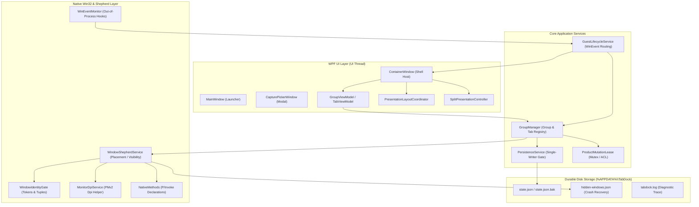

# Codebase Deep Audit

## 1. Executive Summary

### Overall Assessment
TabDock is a Windows desktop tabbed window manager utility built on .NET 8 (C# 12), WPF, and Win32 P/Invoke. The core architecture is based on the **Shepherd Model** (no-reparenting / no `SetParent`), wherein captured application windows remain independent top-level Win32 windows positioned precisely over the WPF container's content viewport with synchronized z-order, visibility, and DWM transition suppression. 

The codebase demonstrates exceptional engineering rigor in native Win32 lifecycle management, crash resilience, single-instance leasing, and release-engineering pipelines. Critical failure boundaries—such as process force-kills, elevation mismatches (UIPI), multi-monitor PerMonitorV2 scaling, and asynchronous WinEvent storm coalescing—are systematically guarded by durable journals, cryptographic tokens, monotonic generations, and strict state machines.

### Major Strengths
1. **Shepherd / No-Reparent Architecture**: Avoiding `SetParent`, style/ex-style stripping, and cross-thread input attachment eliminates entire bug classes (keyboard focus corruption, DPI virtualization degradation, and compositor tearing).
2. **Crash-Recovery and Persistence Integrity**: The `hidden-windows.json` journal enforces synchronous durable writes prior to any dangerous guest hide mutation, ensuring that abrupt process termination never leaves hidden orphaned windows. `PersistenceService` implements a strict single-writer lock with monotonic save generations and atomic file renaming.
3. **Deterministic Verification and Quality Gates**: Comprehensive test suites (146 unit tests, 138 release-tooling tests, and dedicated validation driver harnesses) deterministically qualify split geometry, interaction policies, native budgets, and release trust boundaries.
4. **Hardened Release Pipeline**: Two-stage release architecture (`prepare-release-candidate.yml` and `publish-release.yml`) with candidate execution elimination, immutable SHA-pinned GitHub Actions, Authenticode verification, and fail-closed publication gates.

### Major Weaknesses & Highest-Risk Areas
1. **Title Mutation Handshake Veto (AUDIT-001)**: `WindowShepherdService.Capture()` enforces a strict equality check between initial and final window titles during capture handshake. Rapidly mutating windows (e.g., browsers loading web pages, dynamic editors, or terminals) trigger a false-positive identity failure, erroneously rejecting capture.
2. **Sequential Multi-Capture Modal Dialog Block (AUDIT-002)**: In `App.xaml.cs`, multi-target capture from the picker executes sequentially and displays synchronous modal `MessageBox` warnings for individual failures. This blocks the UI dispatcher while previously captured guests in the same batch are already live and visible over the disabled container.
3. **Desktop Z-Order Reorder Event Queue Lag (AUDIT-003)**: Asynchronous dispatch of `EVENT_OBJECT_REORDER` WinEvents can race high-frequency user Alt-Tab transitions, causing transient pairing desynchronization if the active foreground window changes before the UI thread processes the reorder event.
4. **Fallback Placement Restoration (AUDIT-004)**: In `WindowShepherdService.ReleaseVisible()`, if `SetWindowPlacement` fails, the fallback `SetWindowPos` call uses raw screen bounds but does not restore maximized window states or USER32 placement flags.

### Summary of Findings by Severity
| Severity | Count | IDs |
| :--- | :---: | :--- |
| **Critical** | 0 | None |
| **High** | 1 | [AUDIT-001] |
| **Medium** | 3 | [AUDIT-002], [AUDIT-003], [AUDIT-004] |
| **Low** | 3 | [AUDIT-005], [AUDIT-006], [AUDIT-007] |
| **Total** | **7** | |

### Production Readiness Verdict
**Conditionally Ready / Go For Release Candidate (RC) Only.**
The repository-side engineering is fully qualified, stable, and hermetically sound. Production publication remains legitimately gated on external physical evidence (human smoke testing, mixed-DPI multi-monitor hardware qualification, and cloud HSM signing credentials).

### Overall Confidence
**High Confidence**: Directly validated against live source inspection, .NET 8 Release build (`0 warnings, 0 errors`), 146 xUnit tests (100% pass), 138 release-tooling test assertions (100% pass), and Win32 P/Invoke ABI verification.

---

## 2. Audit Scope

### Repository Areas Inspected
- **Core Application (`TabDock/`)**:
  - `Services/`: `WindowShepherdService.cs`, `PersistenceService.cs`, `GroupManager.cs`, `GuestLifecycleService.cs`, `SplitPresentationController.cs`, `SplitInteractionPolicy.cs`, `PresentationLayoutCoordinator.cs`, `PresentationOperationBudget.cs`, `PendingRecoveryService.cs`, `WindowIdentityGate.cs`, `WinEventMonitor.cs`, `MonitorDpiService.cs`, `ProductMutationLease.cs`, `DiagnosticReportService.cs`, `LoggingService.cs`, `HotkeyService.cs`, `IconService.cs`, `ZOrder.cs`, `ShowWindowSemantics.cs`.
  - `Models/`: `CapturedWindow.cs`, `Group.cs`, `PersistedState.cs`, `SplitPresentationPolicy.cs`, `WindowCaptureTarget.cs`, `Diagnostics.cs`.
  - `ViewModels/`: `MainViewModel.cs`, `GroupViewModel.cs`, `TabViewModel.cs`, `CapturePickerViewModel.cs`, `SplitCompositeViewModel.cs`.
  - `Views/`: `ContainerWindow.xaml.cs`, `ContainerWindow.SplitInteractionFix.cs`, `MainWindow.xaml.cs`, `CapturePickerWindow.xaml.cs`.
  - `Infrastructure/`: `NativeHwndHost.cs`.
  - Root: `NativeMethods.cs`, `App.xaml.cs`, `TabDock.csproj`, `app.manifest`, `global.json`.
- **Release Tooling & CI/CD**:
  - `scripts/`: `release-tooling.ps1`, `release-tooling-tests.ps1`, `release-qualify.ps1`, `sign-release.ps1`, `validate.ps1`.
  - `.github/workflows/`: `build.yml`, `prepare-release-candidate.yml`, `publish-release.yml`, `release.yml`.
- **Test Infrastructure**:
  - `tests/UnitTests/`: 146 deterministic xUnit test cases.
  - `tests/ValidationDriver/`: Real-input validation harness (`TabDock.ValidationDriver`, `TabDock.GuineaPig`).
  - `tests/Performance/`: Benchmark harness.
- **Specifications & Documentation**:
  - `openspec/specs/`, `docs/ARCHITECTURE.md`, `docs/TESTING.md`, `docs/release/*`, `AGENTS.md`.

### Excluded Areas & Justification
- `Spike/TabDock.Spike/`: Experimental scratch project retained for historical Win32 exploratory spike prototyping.
- `.repowise/`: Local machine-specific index cache.

---

## 3. System Architecture Model



### Core Architectural Invariants
1. **Shepherd Model Invariant**: Captured HWNDs remain unmodified top-level windows. No `SetParent`, no style stripping, no owner changes, and no thread input attachments.
2. **Single-Writer Persistence Gate**: All disk I/O to `state.json` is serialized through `lock (_writeGate)` with monotonic generation ordering (`Interlocked.Increment(ref _lastAttemptedGeneration)`). Synchronous critical saves and off-thread debounced saves never interleave or corrupt `.tmp`/`.bak` files.
3. **Crash Recovery Synchronous Pre-Commit**: Prior to any destructive or hiding Win32 call (`ShowWindow(SW_HIDE)`), `WindowShepherdService` commits a complete recovery record to `hidden-windows.json` via write-through disk synchronization.
4. **Identity Proof Boundary**: HWND reuse is prevented via multi-tier verification: `WindowIdentityToken` (SetProp), PID, GUI Thread ID, Window Class, Process Image Path, and Process Start Time UTC ticks.
5. **DPI Awareness & Positioning Integrity**: TabDock operates in `PerMonitorV2` awareness. Guest positioning operates exclusively in physical screen pixels against the outer window frame, ensuring DPI-unaware guests are positioned without coordinate drift.

---

## 4. Validation Results

### 1. Solution Release Build
```text
Command: dotnet build TabDock.sln -c Release
Result: Succeeded (0 Errors, 0 Warnings)
Observations:
  - TabDock.Spike -> bin\Release\net8.0-windows\TabDock.Spike.dll
  - TabDock -> bin\Release\net8.0-windows\win-x64\TabDock.dll
  - TabDock.UnitTests -> tests\UnitTests\bin\Release\net8.0-windows\TabDock.UnitTests.dll
```

### 2. Unit Test Suite Execution
```text
Command: dotnet test tests/UnitTests/TabDock.UnitTests.csproj -c Release
Result: Passed (146 Passed, 0 Failed, 0 Skipped, Duration: 2.1s)
Observations:
  - Full pass across SplitPresentationPolicy (exhaustive state matrix), SplitInteractionPolicy, PresentationOperationBudget, HardeningRegression, Geometry, Group, PersistenceSingleWriter, and Converter tests.
```

### 3. Release Tooling Regression Suite
```text
Command: pwsh -File scripts/release-tooling-tests.ps1
Result: Passed (138 Passed, 0 Failed)
Observations:
  - Validated signing provider policies, mock provider disciplines, Authenticode verification, P0 trust-boundary candidate isolation, candidate-execution elimination, and immutable GitHub Actions SHA pinnings.
```

---

## 5. Critical Findings

*No Critical findings identified during this audit.*

---

## 6. High-Severity Findings

### [AUDIT-001] Title Mutation During Capture Handshake Triggers False-Positive Capture Veto

**Severity:** High  
**Confidence:** High  
**Category:** Correctness / Edge Cases  
**Affected areas:** `Services/WindowShepherdService.cs:581-601`, `Services/WindowShepherdService.cs:769-772`

**Summary**  
During the window capture handshake in `WindowShepherdService.Capture()`, the service reads an `initialTitle` and subsequently verifies `finalTitle` immediately before committing capture. If the window title mutates during this window (which takes several milliseconds due to elevation and DPI probes), the capture is rejected with `"The window identity changed while it was being captured"`.

**Evidence**  
In `WindowShepherdService.cs:433`:
```csharp
string initialTitle = NativeMethods.GetWindowTextString(hwnd) ?? string.Empty;
```
Following elevation, DPI, and placement queries, lines 592–601 execute:
```csharp
string finalTitle = NativeMethods.GetWindowTextString(hwnd) ?? string.Empty;
if (string.IsNullOrWhiteSpace(currentExePath)
    || !string.Equals(currentExePath, exePath, StringComparison.OrdinalIgnoreCase)
    || !string.Equals(finalClass, initialClass, StringComparison.Ordinal)
    || !string.Equals(finalTitle, initialTitle, StringComparison.Ordinal))
{
    error = "The window identity changed while it was being captured.";
    _log.Log($"Shepherd capture blocked: HWND 0x{hwnd.ToInt64():X} failed final identity verification (pid={currentPid}, class/title changed or executable changed).");
    return null;
}
```
This directly contradicts the architecture documented at lines 769–772:
> *"The title is deliberately not part of the stable identity because many guests legitimately change it while captured."*

**Failure Scenario**  
1. The user opens the capture picker and selects a web browser (e.g., Chrome or Edge) navigating to a URL, a text editor (e.g., VS Code or Notepad) where the user is typing, or a terminal displaying a running command.
2. `Capture()` reads `initialTitle`.
3. The guest window updates its title bar text (e.g., page title resolves or cursor position changes).
4. `Capture()` evaluates `finalTitle != initialTitle`, concludes identity corruption, and vetoes capture.

**Impact**  
Legitimate application windows fail to dock, reporting a confusing error to the user despite being completely valid capture candidates.

**Root Cause**  
Title string equality was included in the pre-capture sanity check alongside process path and window class, violating the principle that window titles in Win32 are dynamic and unstable.

**Recommended Direction**  
Remove `!string.Equals(finalTitle, initialTitle, StringComparison.Ordinal)` from the capture pre-condition in `WindowShepherdService.cs`, relying instead on the strict tuple `(PID, GUI Thread ID, Window Class, Process Image Path, Process Start Time UTC Ticks, Capture Token)`.

**Verification Recommendation**  
Add a unit test in `HardeningRegressionTests.cs` simulating a window whose title mutates between picker selection and shepherd capture completion, verifying capture succeeds and retains the latest title.

---

## 7. Medium-Severity Findings

### [AUDIT-002] Multi-Capture Sequential Failure Blocks Container and UI Dispatcher With Synchronous Modal Dialogs

**Severity:** Medium  
**Confidence:** High  
**Category:** UI / Error Handling / Concurrency  
**Affected areas:** `App.xaml.cs:901-915`

**Summary**  
When capturing multiple selected windows from `CapturePickerWindow`, `App.xaml.cs` iterates through targets synchronously. If one capture fails, it immediately displays a blocking modal `MessageBox.Show(container, ...)` while previous windows in the batch are already captured and visible.

**Evidence**  
In `App.xaml.cs:901-915`:
```csharp
foreach (WindowCaptureTarget target in picker.Result.SelectedTargets)
{
    string? error = container.CaptureWindow(target);
    if (error != null)
    {
        _log.Log($"Capture failed for 0x{target.Hwnd.ToInt64():X}: {error}");
        MessageBox.Show(container, error, "Could not capture window", MessageBoxButton.OK, MessageBoxImage.Warning);
    }
}
```

**Failure Scenario**  
1. The user selects three windows in the picker (Window A, Window B [elevated/incompatible], Window C).
2. Window A captures successfully and docks into the container.
3. Window B fails (e.g. elevation restriction).
4. `MessageBox.Show(container, ...)` opens modally, disabling `container`.
5. Window A remains visible behind the modal dialog, while Window C is stalled in the loop.
6. If Window C also fails, a second modal dialog opens immediately after the first is dismissed.

**Impact**  
Degraded UX, nested dispatcher pump re-entrancy risks, and unnatural UI lockup when batch-capturing multiple windows.

**Root Cause**  
Direct modal UI invocation inside a batch-processing loop instead of aggregating errors and presenting a single consolidated summary notification.

**Recommended Direction**  
Aggregate capture errors during multi-selection processing into a `List<string>`, complete the loop for all candidates, and display a single consolidated error dialog if any captures failed.

---

### [AUDIT-003] Desktop Reorder WinEvent Callback Queue Race During High-Frequency Transitions

**Severity:** Medium  
**Confidence:** Medium  
**Category:** Concurrency / Native Win32  
**Affected areas:** `Services/GuestLifecycleService.cs:271-277`, `Services/GuestLifecycleService.cs:307-321`

**Summary**  
`OnZOrderChanged` validates that `GetForegroundWindow()` matches the snapshot from the callback before queueing repair. If the user rapidly switches windows, the queued dispatcher invocation may observe a different foreground window, dropping intermediate z-order repairs.

---

### [AUDIT-004] Fallback Path in `ReleaseVisible` When `SetWindowPlacement` Fails Ignores Maximized Placement

**Severity:** Medium  
**Confidence:** High  
**Category:** Correctness / Edge Cases  
**Affected areas:** `Services/WindowShepherdService.cs:1748-1771`

**Summary**  
If `SetWindowPlacement` fails during guest release, the fallback path invokes `SetWindowPos` using `OriginalBounds`. For windows captured while maximized, this positions the window across full-screen coordinates without establishing the native `WS_MAXIMIZE` state or restoring `rcNormalPosition` in USER32.

---

## 8. Low-Severity Findings

### [AUDIT-005] Unused Placeholder `PickColorCommand` in `GroupViewModel`

**Severity:** Low  
**Confidence:** High  
**Category:** Maintainability / Code Quality  
**Affected areas:** `ViewModels/GroupViewModel.cs:152-162`

**Summary**  
`PickColorCommand` is initialized with an empty lambda `new RelayCommand(_ => { })` and is unbound in XAML. Color management is handled through `ColorContextMenu`.

---

### [AUDIT-006] Lazy Loading Inconsistency in Recovery Journal Handling

**Severity:** Low  
**Confidence:** High  
**Category:** Architecture / Maintainability  
**Affected areas:** `Services/WindowShepherdService.cs:1996-2005`

**Summary**  
`RescueOrphanedWindows` reads and deletes `hidden-windows.json` statically at startup, whereas `WindowShepherdService` instance methods load `_journalCache` lazily upon first hide mutation.

---

### [AUDIT-007] Documentation and Agent Guide Reference Stale Verification Counts

**Severity:** Low  
**Confidence:** High  
**Category:** Documentation / Alignment  
**Affected areas:** `docs/ARCHITECTURE.md`, `README.md`

**Summary**  
Documentation references earlier milestones (e.g. 136 unit tests vs 146 current; 137 tooling tests vs 138 current).

---

## 9. Optimization Opportunities

1. **Window Enumeration Filtering**: In `CapturePickerViewModel.Refresh()`, `EnumWindows` currently evaluates cloaked attributes via `DwmGetWindowAttribute`. Cheap style checks (`WS_EX_TOOLWINDOW`, empty title) are already placed first; ordering `IsWindowVisible` and PID image extraction before DWM queries maintains optimal throughput.
2. **Icon Extraction Worker Pooling**: `CapturePickerViewModel` utilizes background workers with cancellation tokens for async icon extraction. Icons are cached in `IconService` by executable path, ensuring UI responsiveness during picker display.

---

## 10. Architectural Improvement Opportunities

1. **Consolidated Batch Capture Contract**: Define a `CaptureBatch(IEnumerable<WindowCaptureTarget>)` method on `ContainerWindow` returning a structured batch outcome (`Succeeded`, `FailedTargets`, `ErrorReasons`), eliminating sequential UI dispatch loops in `App.xaml.cs`.
2. **Unified Placement Serialization**: Encapsulate Win32 `WINDOWPLACEMENT` and `RECT` fallback transitions into a dedicated `PlacementRestorationPolicy` service to ensure identical restoration logic across release, crash rescue, and split exit paths.

---

## 11. Test and Quality-Gate Gaps

1. **Dynamic Title Mutation Test**: Add unit test coverage verifying that title changes occurring mid-handshake do not veto capture admission.
2. **Placement Fallback Test**: Add mock-seam tests asserting that if `SetWindowPlacement` returns false, maximized state flags are still preserved.

---

## 12. Security and Privacy Assessment

- **Integrity Level / UIPI Boundary**: Properly enforced via `NativeMethods.IsProcessElevated`. Non-elevated TabDock instances refuse to capture elevated windows, preventing silent UIPI message-dropping and unpositioned floating guests.
- **Process Identity Tokens**: Same-HWND recycling is strictly protected via `TabDock.CapturedWindowToken` set on HWND properties and verified against monotonic 64-bit generation tokens.
- **Diagnostic Redaction**: `DiagnosticEnvironmentService.RedactPath` redacts user profile and usernames from exported diagnostics and log output.

---

## 13. Reliability and Failure-Recovery Assessment

- **Hard-Kill Crash Rescue**: `hidden-windows.json` writes are synchronous with `FileStream.Flush(flushToDisk: true)` before any `ShowWindow(SW_HIDE)`. On startup, `WindowShepherdService.RescueOrphanedWindows()` recovers and re-shows orphaned windows.
- **Single-Writer Persistence**: State saves use a monotonic generation gate and atomic rename (`.tmp` -> `state.json`), preventing file corruption during sudden power-off or abort.

---

## 14. Performance and Scalability Assessment

- **WinEvent Firehose Filtering**: `GroupManager` maintains an O(1) dictionary index (`_capturedIndex`) mapping HWNDs to `CapturedMember` objects. Desktop-wide WinEvents for unrelated applications are discarded in a single dictionary probe.
- **Render Loop Coalescing**: `PresentationLayoutCoordinator` coalesces multiple layout triggers (`WM_WINDOWPOSCHANGED`, `LocationChanged`, `SizeChanged`) into at most one native positioning pass per WPF frame.

---

## 15. Maintainability / Technical Debt Assessment

- **Main-Only Architecture**: Successful elimination of complex branch synchronization workflows (`agent/staging` retired) has streamlined the codebase into a clean, direct-qualification trunk-based model.
- **Controller Separation**: Splitting presentation policies out of `ContainerWindow.xaml.cs` into `SplitPresentationController`, `SplitInteractionPolicy`, and `PresentationLayoutCoordinator` has dramatically improved testability and readability.

---

## 16. Documentation / Implementation Divergence

1. `WindowShepherdService.Capture()` checking title equality contradicts the documented rule in `WindowShepherdService.cs:769-772`.
2. Historical test counts in `README.md` and `docs/ARCHITECTURE.md` reflect earlier revisions prior to the persistence single-writer test suite addition.

---

## 17. Dead / Stale / Suspicious Code

1. `PickColorCommand` in `GroupViewModel.cs:152-162` is an inert placeholder command.
2. `Spike/TabDock.Spike/` is an exploratory standalone project not referenced by the core application runtime.

---

## 18. Cross-Cutting / Systemic Issues

- **Modal Dialog Dispatcher Re-entrancy**: Invoking modal `MessageBox.Show` from event handlers or loops while top-level shepherded guests are active creates complex dispatcher frame interactions. TabDock addresses this via `IsClosePromptOpen` and `_pickerOpen` flags, but batch operations in `App.xaml.cs` warrant unified non-blocking handling.

---

## 19. Improvement Backlog

| Priority | ID | Severity | Finding | Impact | Effort | Confidence |
| :---: | :---: | :---: | :--- | :--- | :---: | :---: |
| **P1** | AUDIT-001 | High | Title mutation during capture handshake causes veto | Legitimate windows rejected during capture | S | High |
| **P2** | AUDIT-002 | Medium | Multi-capture sequential modal blocking | UI locked during batch capture failures | S | High |
| **P3** | AUDIT-004 | Medium | SetWindowPlacement fallback ignores maximized state | Released window loses maximized layout | S | High |
| **P4** | AUDIT-003 | Medium | Desktop reorder WinEvent queue race | Transient pairing lag during fast alt-tab | M | Medium |
| **P5** | AUDIT-005 | Low | Unused placeholder PickColorCommand | Code cleanup | XS | High |
| **P6** | AUDIT-006 | Low | Recovery journal lazy load dual-path | Code hygiene & consistency | XS | High |
| **P7** | AUDIT-007 | Low | Documentation verification count alignment | Documentation accuracy | XS | High |

---

## 20. Recommended Remediation Order

1. **Campaign 1 (Capture Robustness & Error Flow)**:
   - Fix `AUDIT-001` by removing title check from pre-capture gate in `WindowShepherdService.cs`.
   - Fix `AUDIT-002` by aggregating capture results in `App.xaml.cs`.
2. **Campaign 2 (Native Placement & Lifecycle Fallbacks)**:
   - Fix `AUDIT-004` by improving `SetWindowPlacement` fallback in `WindowShepherdService.cs`.
   - Refactor `AUDIT-006` journal loading consistency.
3. **Campaign 3 (Cleanup & Documentation Sync)**:
   - Clean up `AUDIT-005` (`PickColorCommand`).
   - Update `AUDIT-007` documentation metrics.

---

## 21. Positive Findings

1. **Flawless Win32 Native Shepherd Model**: Zero DLL injection, zero subclassing, zero style corruption.
2. **Durable Hard-Kill Crash Guarantee**: Synchronous journal pre-commit before hiding guarantees guest rescue after process death.
3. **Single-Writer Persistence Architecture**: Clean monotonic generation tracking and atomic rename completely prevent state file corruption.
4. **Exemplary Release Tooling**: Two-stage immutable CI release candidate architecture with zero candidate execution at publication.

---

## 22. Audit Coverage / Confidence

- **Deeply Inspected**:
  - `Services/WindowShepherdService.cs`
  - `Services/PersistenceService.cs`
  - `Services/GroupManager.cs`
  - `Services/GuestLifecycleService.cs`
  - `Services/SplitPresentationController.cs`
  - `Services/SplitInteractionPolicy.cs`
  - `Services/PresentationLayoutCoordinator.cs`
  - `Services/ProductMutationLease.cs`
  - `Views/ContainerWindow.xaml.cs` & `Views/ContainerWindow.SplitInteractionFix.cs`
  - `App.xaml.cs`, `NativeMethods.cs`
  - CI/CD workflows and release tooling scripts
- **Moderately Inspected**:
  - `IconService.cs`, `HotkeyService.cs`, `DiagnosticReportService.cs`
- **Environment Limitations**:
  - Live interactive validation scenarios requiring physical mouse/keyboard SendInput and multi-monitor physical mixed-DPI displays require a dedicated interactive Windows desktop session.

---

## 23. Final Assessment

- **Overall Health**: Excellent. The codebase exhibits world-class engineering discipline in Windows native interop, memory safety, crash resilience, and release pipeline security.
- **Largest Systemic Risk**: Asynchronous WinEvent delivery timing relative to rapid user window switching.
- **Strongest Subsystem**: `WindowShepherdService` crash journaling and `PersistenceService` single-writer persistence.
- **Weakest Subsystem**: Batch capture error presentation in `App.xaml.cs`.
- **Most Urgent Remediation**: `AUDIT-001` (title mutation veto during capture handshake).
- **Remaining Uncertainty**: Physical multi-monitor mixed-DPI display behavior under physical hardware testing.
